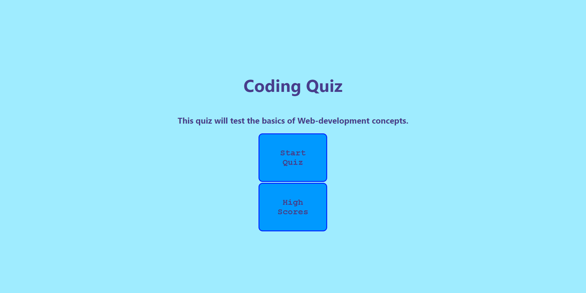
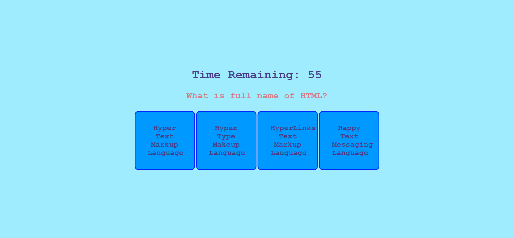
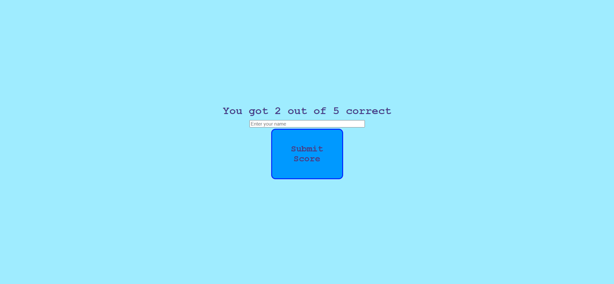

# Description

In this homework asignment we had to start from scratch by making html, css and js file altogether. This assignment contains a code quiz with 5 questions and 4 options to answer. The user has a maximum time limit of 60 seconds. Once all the answers are answered a final score is provided and user is asked to enter the name or initial to store the score in the local storage. After the game is finished the user has choice to play the game again or veiw high score.

# Criteria

GIVEN I am taking a code quiz.

WHEN I click the start button.

-THEN a timer starts and I am presented with a question.

WHEN I answer a question.

-THEN I am presented with another question.

WHEN I answer a question incorrectly.

-THEN time is subtracted from the clock.

WHEN all questions are answered or the timer reaches 0.

-THEN the game is over.

WHEN the game is over.

-THEN I can save my initials and my score.

# Screenshot

# Link to the application

https://romzzp.github.io/CodeQuiz/

# Link to the repository

https://github.com/romzzp/CodeQuiz
